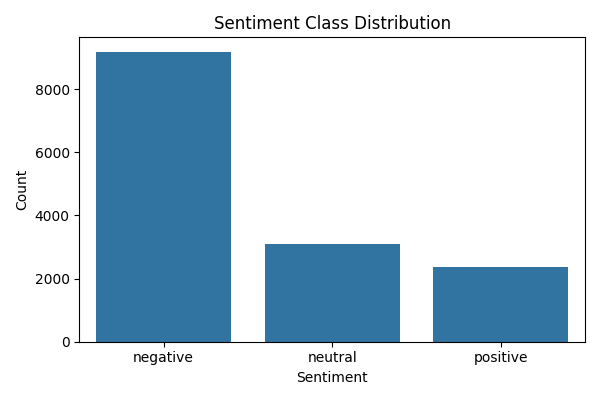
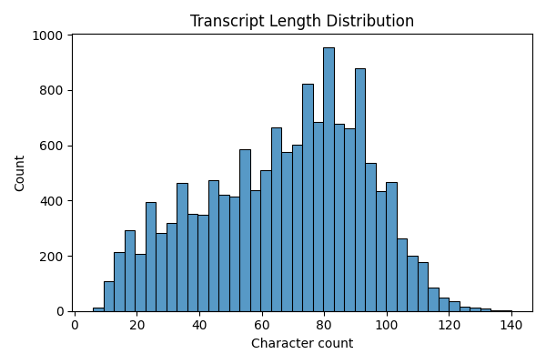
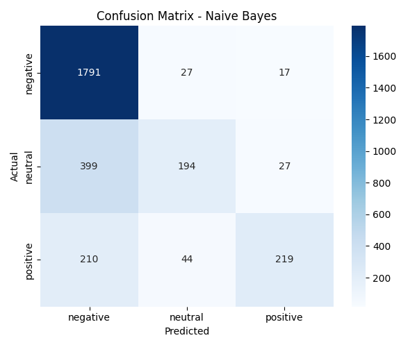
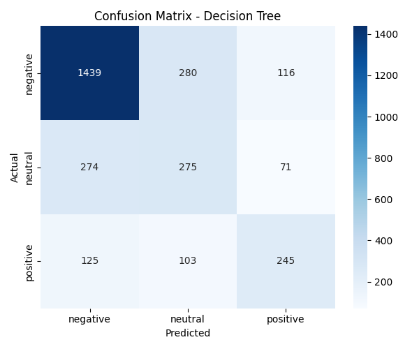

<div align="center">

# 💬 Customer Sentiment Analysis

### Classifying customer sentiment from text using NLP + Machine Learning

[](https://www.python.org/)
[](https://scikit-learn.org/)
[](https://www.nltk.org/)
[](https://jupyter.org/)
[](LICENSE)


</div>

---

## 📖 Overview

Companies collect massive volumes of customer feedback across **social media, chat, and email** — but reading every message manually doesn't scale. This project uses **Natural Language Processing (NLP)** and classical **Machine Learning** to automatically classify customer sentiment as **Positive**, **Negative**, or **Neutral**, using real-world airline customer tweets as the dataset.

🏆 **Best model:** Naive Bayes — **75.3% accuracy**

---

## 🖼️ Results Preview

<div align="center">


</div>

<div align="center">


</div>

---

## 🗂️ Project Structure

```
Customer-Sentiment-Analysis/
├── Dataset/                # Raw transcript data
├── notebooks/
│   └── Code.ipynb           # EDA + modeling notebook
├── src/
│   ├── preprocess.py         # Text cleaning, tokenization, lemmatization
│   ├── train.py              # Training pipeline (CLI)
│   └── predict.py            # Inference on new transcripts
├── images/                  # Saved plots
├── models/                  # Trained model artifacts (gitignored)
├── requirements.txt
├── LICENSE
└── README.md
```

---

## 🎯 Objectives

- 🔍 Analyze customer transcripts using NLP techniques
- 🏷️ Classify sentiment as Positive / Negative / Neutral
- 📊 Identify key insights and patterns via EDA
- 🆚 Compare multiple ML models on real-world text data
- 💡 Provide a reusable, reproducible pipeline

---

## ⚙️ Methodology

| Step | Description |
|------|-------------|
| 1️⃣ Data Collection | Real-world airline customer tweets dataset |
| 2️⃣ Text Preprocessing | Lowercasing, punctuation removal, stopword removal, lemmatization |
| 3️⃣ Feature Extraction | TF-IDF vectorization (unigrams + bigrams) |
| 4️⃣ EDA | Class distribution, transcript length distribution |
| 5️⃣ Modeling | Naive Bayes, Decision Tree, KNN |
| 6️⃣ Evaluation | Accuracy, Precision, Recall, F1-score, Confusion Matrix |

---

## 📊 Results

| Model | Accuracy |
|-------|:--------:|
| 🥇 **Naive Bayes** | **75.3%** |
| 🥈 KNN | 69.7% |
| 🥉 Decision Tree | 66.9% |

**Key Insights:**
- 📉 Negative sentiment is the majority class and is predicted most reliably across all models
- 😐 Neutral sentiment is the hardest class to detect — likely due to ambiguous/short text
- 🥇 Naive Bayes generalizes best on short, sparse text like tweets

---

## 🚀 Getting Started

### 1️⃣ Clone the repo
```bash
git clone https://github.com/navdeepkaiml-hub/Customer-Sentiment-Analysis.git
cd Customer-Sentiment-Analysis
```

### 2️⃣ Install dependencies
```bash
py -m pip install -r requirements.txt
```

### 3️⃣ Train the models
```bash
py src/train.py --data Dataset/transcripts.csv --text-col text --label-col airline_sentiment
```

### 4️⃣ Predict on new text
```bash
py src/predict.py --text "The support agent resolved my issue quickly and was very polite"
```

### 📓 Or explore interactively
```bash
jupyter notebook notebooks/Code.ipynb
```

---

## 🛠️ Tech Stack

<div align="left">


</div>

---

## 🔭 Future Work

- 🤖 Try deep learning (LSTM, BERT) for higher accuracy
- 🎯 Extend to aspect-based sentiment analysis
- 😊 Add emotion detection beyond positive/negative/neutral
- 🌐 Deploy as a real-time API for live text scoring

---

## 👤 Author

**Navdeep Kumar**
B.Tech CSE (AI & ML) — Roorkee Institute of Technology

[](https://github.com/navdeepkaiml-hub)

---

## 📄 License

This project is licensed under the [MIT License](LICENSE).

<div align="center">

⭐ If you found this project useful, consider giving it a star!

</div>
